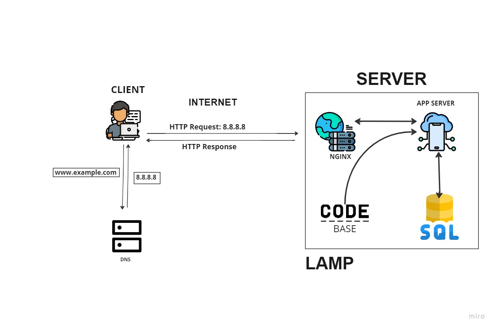

# Simple Web Stack Infrastructure Design

## Overview
This document describes a one-server web infrastructure that hosts a website reachable via www.foobar.com. The infrastructure follows a simple LAMP stack architecture.

## Infrastructure Components

### 1. Server
- **Type**: Single physical or virtual server
- **IP Address**: 8.8.8.8
- **Purpose**: Hosts all infrastructure components in a single environment

### 2. Web Server (Nginx)
- **Role**: Serves static content and acts as a reverse proxy
- **Functions**:
  - Handles HTTP/HTTPS requests from users
  - Serves static files (HTML, CSS, JavaScript, images)
  - Routes dynamic requests to the application server
  - Manages SSL/TLS termination
  - Handles load balancing (in this case, to a single app server)

### 3. Application Server
- **Role**: Executes application logic and business rules
- **Functions**:
  - Processes dynamic requests
  - Runs application code (PHP, Python, Node.js, etc.)
  - Generates dynamic content
  - Handles user sessions and authentication
  - Communicates with the database

### 4. Application Files (Code Base)
- **Role**: Contains the website's source code and assets
- **Components**:
  - HTML templates
  - CSS stylesheets
  - JavaScript files
  - Application logic files
  - Configuration files
  - Static assets (images, fonts, etc.)

### 5. Database (MySQL)
- **Role**: Stores and manages data
- **Functions**:
  - Stores user data, content, and application state
  - Handles data queries and transactions
  - Manages data relationships and integrity
  - Provides data persistence

### 6. Domain Name Configuration
- **Domain**: foobar.com
- **Subdomain**: www.foobar.com
- **DNS Record Type**: CNAME record
- **Configuration**: www record points to server IP 8.8.8.8

## User Request Flow

1. **User Action**: User types www.foobar.com in their browser
2. **DNS Resolution**: Browser queries DNS for www.foobar.com
3. **DNS Response**: DNS returns IP address 8.8.8.8
4. **HTTP Request**: Browser sends HTTP request to 8.8.8.8
5. **Web Server**: Nginx receives the request
6. **Request Routing**: Nginx routes static requests directly or dynamic requests to app server
7. **Application Processing**: App server processes request and may query database
8. **Response Generation**: App server generates response and sends it back through Nginx
9. **User Response**: Nginx sends final response to user's browser

## Communication Protocol
The server uses **HTTP/HTTPS** protocol to communicate with users' computers. This is the standard web protocol that enables:
- Request/response communication
- Stateless interactions
- Support for various content types
- Security through HTTPS encryption

## Infrastructure Issues and Limitations

### 1. Single Point of Failure (SPOF)
- **Problem**: If the single server fails, the entire website becomes unavailable
- **Impact**: Complete service outage affecting all users
- **Risk Factors**: Hardware failure, power outage, network issues, OS crashes

### 2. Maintenance Downtime
- **Problem**: Server maintenance requires taking the entire service offline
- **Scenarios**:
  - Deploying new code requires restarting web server
  - Database maintenance affects all users
  - OS updates require server reboot
  - Security patches cause service interruption

### 3. Scalability Limitations
- **Problem**: Cannot handle increased traffic beyond server capacity
- **Constraints**:
  - Limited CPU and memory resources
  - Network bandwidth limitations
  - Database connection limits
  - No horizontal scaling capability
- **Impact**: Performance degradation or service unavailability during traffic spikes

## Recommendations for Production Use

While this simple architecture is suitable for:
- Development and testing environments
- Small personal websites
- Low-traffic applications
- Learning and demonstration purposes

For production environments, consider:
- Multiple servers for redundancy
- Load balancers for traffic distribution
- Database clustering and replication
- CDN for static content delivery
- Monitoring and alerting systems
- Automated backup and recovery procedures

## Conclusion

This simple web stack provides a functional foundation for hosting a website but lacks the reliability, scalability, and maintainability required for production environments. It serves as an excellent starting point for understanding web infrastructure fundamentals and can be enhanced incrementally as requirements grow.
