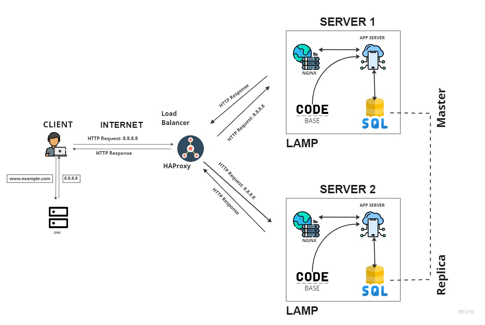

# Distributed Web Infrastructure Design

## Overview
This document describes a three-server web infrastructure that hosts the website www.foobar.com with load balancing and database replication for improved reliability and performance.

## Infrastructure Components

### 1. Load Balancer (HAproxy)
- **Role**: Distributes incoming traffic across multiple web servers
- **Distribution Algorithm**: Round Robin (default) - distributes requests sequentially across available servers
- **Setup**: Active-Active configuration where all load balancer instances are actively serving traffic
- **Benefits**: 
  - Eliminates single point of failure
  - Improves response time through request distribution
  - Enables horizontal scaling

### 2. Web Servers (Nginx) - 2 Servers
- **Role**: Serve static content and act as reverse proxies
- **Configuration**: Identical setup on both servers
- **Functions**:
  - Handle HTTP requests from load balancer
  - Serve static files
  - Route dynamic requests to application servers
  - SSL/TLS termination

### 3. Application Servers - 2 Servers
- **Role**: Execute application logic and business rules
- **Configuration**: Identical application deployment on both servers
- **Functions**:
  - Process dynamic requests
  - Run application code
  - Generate dynamic content
  - Handle user sessions

### 4. Database Cluster (MySQL Primary-Replica)
- **Primary Node**: 
  - Accepts write operations (INSERT, UPDATE, DELETE)
  - Handles data modifications
  - Manages transaction logs
  - Coordinates with replica nodes
- **Replica Node**:
  - Accepts read operations (SELECT)
  - Provides read scalability
  - Serves as backup for primary
  - Reduces load on primary database

## Why Additional Elements Were Added

### Load Balancer
- **Purpose**: Distribute traffic and eliminate SPOF
- **Benefit**: Improves availability and performance

### Additional Web/App Servers
- **Purpose**: Handle increased traffic and provide redundancy
- **Benefit**: Better performance and fault tolerance

### Database Replication
- **Purpose**: Separate read and write operations
- **Benefit**: Improved performance and data availability

## Load Balancer Configuration

### Distribution Algorithm: Round Robin
- **How it works**: Distributes requests sequentially across available servers
- **Example**: Request 1 → Server A, Request 2 → Server B, Request 3 → Server A, etc.
- **Advantages**: Simple, fair distribution, no server preference
- **Disadvantages**: May not consider server load or response time

### Active-Active vs Active-Passive

**Active-Active Setup:**
- All load balancer instances actively serve traffic
- Better performance and resource utilization
- More complex configuration and synchronization
- Higher availability

**Active-Passive Setup:**
- One instance active, others standby
- Simpler configuration
- Lower resource utilization
- Potential failover delay

## Database Primary-Replica Cluster

### How It Works
1. **Primary Node**: Handles all write operations and maintains transaction logs
2. **Replication**: Primary sends changes to replica nodes via binary logs
3. **Replica Nodes**: Apply changes from primary and serve read requests
4. **Synchronization**: Replicas stay updated with primary data

### Primary vs Replica Differences

**Primary Node (Application Perspective):**
- Handles data modifications
- Higher resource usage
- Critical for data integrity
- Single point of failure for writes

**Replica Node (Application Perspective):**
- Handles data queries
- Lower resource usage
- Can be scaled horizontally
- Provides read redundancy

## Infrastructure Issues

### 1. Single Points of Failure (SPOF)
- **Load Balancer**: If HAproxy fails, no traffic distribution
- **Primary Database**: If primary fails, no write operations possible
- **Network**: Single network path to internet

### 2. Security Issues
- **No Firewall**: Unprotected against unauthorized access
- **No HTTPS**: Data transmitted in plain text
- **No Authentication**: No access control mechanisms

### 3. No Monitoring
- **No Visibility**: Cannot track performance or issues
- **No Alerts**: No notification of failures
- **No Metrics**: Cannot measure system health

## Recommendations

### Security Improvements
- Implement firewalls at network boundaries
- Enable HTTPS with SSL certificates
- Add authentication and authorization

### Monitoring Implementation
- Deploy monitoring agents on all servers
- Set up centralized logging
- Implement alerting for critical issues

### High Availability
- Deploy multiple load balancer instances
- Implement database failover mechanisms
- Add network redundancy
