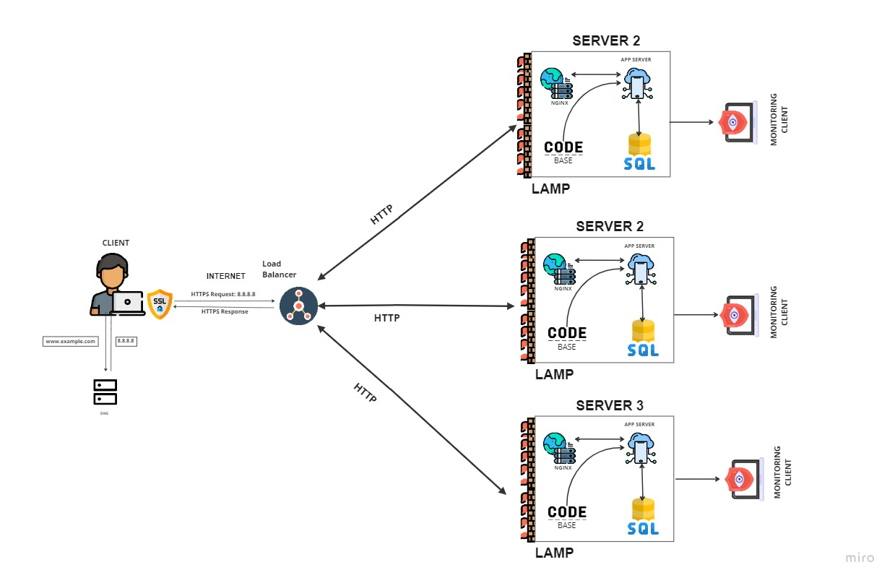

# Secured and Monitored Web Infrastructure Design

## Overview
This document describes a three-server web infrastructure that hosts the website www.foobar.com with comprehensive security measures, encrypted traffic, and monitoring capabilities.

## Infrastructure Components

### 1. Firewalls (3 Firewalls)
- **Purpose**: Control network traffic and protect against unauthorized access
- **Placement**:
  - External firewall: Protects against internet threats
  - Internal firewall: Segregates web/app layer from database layer
  - Database firewall: Protects database servers
- **Functions**:
  - Block malicious traffic
  - Allow only necessary ports and protocols
  - Prevent unauthorized access attempts
  - Log security events

### 2. SSL Certificate and HTTPS
- **Purpose**: Encrypt data transmission between users and servers
- **Benefits**:
  - Data confidentiality and integrity
  - User trust and compliance
  - Protection against man-in-the-middle attacks
  - SEO benefits (Google preference for HTTPS)

### 3. Monitoring Clients (3 Monitoring Agents)
- **Purpose**: Collect system metrics and performance data
- **Data Collected**:
  - Server performance metrics (CPU, memory, disk)
  - Application metrics (response times, error rates)
  - Network metrics (bandwidth, latency)
  - Security events and alerts

## Why Additional Elements Were Added

### Firewalls
- **Security**: Protect against cyber attacks and unauthorized access
- **Compliance**: Meet security standards and regulations
- **Network Segmentation**: Isolate different infrastructure layers

### SSL/HTTPS
- **Privacy**: Encrypt sensitive user data
- **Trust**: Build user confidence in the website
- **Security**: Prevent data interception and tampering

### Monitoring
- **Visibility**: Track system performance and health
- **Proactive Management**: Identify issues before they become problems
- **Capacity Planning**: Understand resource usage patterns

## Firewall Functions

### Network Protection
- **Access Control**: Allow/deny traffic based on rules
- **Port Filtering**: Restrict access to specific ports
- **Protocol Filtering**: Control allowed network protocols
- **IP Filtering**: Block malicious IP addresses

### Security Features
- **Intrusion Detection**: Identify suspicious activity patterns
- **Logging**: Record all network events for analysis
- **Rate Limiting**: Prevent DDoS attacks
- **Stateful Inspection**: Track connection states

## HTTPS Traffic Benefits

### Encryption
- **Data Protection**: All data transmitted is encrypted
- **Privacy**: User information cannot be intercepted
- **Integrity**: Data cannot be modified in transit

### Security Advantages
- **Authentication**: Verify server identity
- **Trust**: Users see secure connection indicators
- **Compliance**: Meet data protection requirements

### Performance Considerations
- **SSL Handshake**: Initial connection setup overhead
- **Modern Optimization**: HTTP/2 and TLS 1.3 improvements
- **CDN Integration**: Edge SSL termination for better performance

## Monitoring Implementation

### Data Collection
- **Agent-Based**: Monitoring clients installed on each server
- **Metrics Collection**: System, application, and business metrics
- **Log Aggregation**: Centralized log collection and analysis
- **Real-Time Data**: Continuous monitoring and alerting

### Monitoring Tools
- **Infrastructure Monitoring**: CPU, memory, disk, network
- **Application Monitoring**: Response times, error rates, throughput
- **Business Metrics**: User engagement, conversion rates
- **Security Monitoring**: Failed login attempts, suspicious activity

### Web Server QPS Monitoring

**QPS (Queries Per Second)** measures the number of requests a web server can handle per second.

**To Monitor QPS:**
1. **Server-Level Metrics**:
   - Track HTTP request rates
   - Monitor response times
   - Measure error rates

2. **Load Balancer Metrics**:
   - Request distribution across servers
   - Backend server health
   - Connection counts

3. **Application Metrics**:
   - Database query performance
   - Cache hit rates
   - External API response times

4. **Business Metrics**:
   - User sessions per second
   - Page load times
   - Transaction completion rates

## Infrastructure Issues

### 1. SSL Termination at Load Balancer
**Problem**: SSL is terminated at the load balancer, not end-to-end
**Issues**:
- Data between load balancer and servers is unencrypted
- Potential security vulnerability in internal network
- Compliance issues for sensitive data

**Solutions**:
- Implement end-to-end encryption
- Use internal SSL certificates
- Encrypt database connections

### 2. Single MySQL Write Server
**Problem**: Only one database server can accept write operations
**Issues**:
- Single point of failure for writes
- No automatic failover for write operations
- Potential data loss if primary fails

**Solutions**:
- Implement database clustering
- Use distributed databases
- Implement write replication

### 3. Identical Components on All Servers
**Problem**: All servers have the same components (web, app, database)
**Issues**:
- Resource contention
- Security risk (larger attack surface)
- Maintenance complexity
- Performance degradation

**Solutions**:
- Separate concerns (web, app, database servers)
- Implement proper service isolation
- Use containerization for better resource management

## Security Best Practices

### Network Security
- Implement defense in depth
- Regular security audits
- Penetration testing
- Security monitoring and alerting

### Data Protection
- Encrypt data at rest and in transit
- Implement access controls
- Regular backup and recovery testing
- Data classification and handling

### Monitoring and Response
- Real-time security monitoring
- Incident response procedures
- Security metrics and reporting
- Continuous improvement processes
